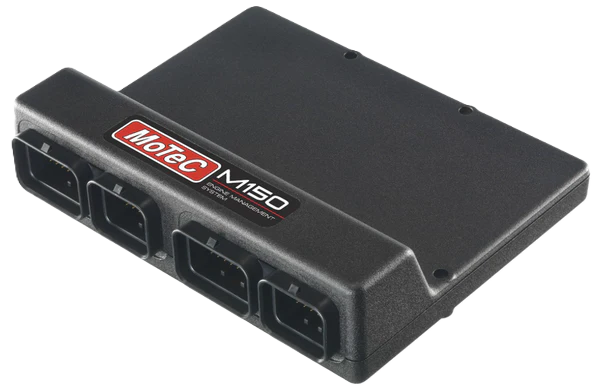
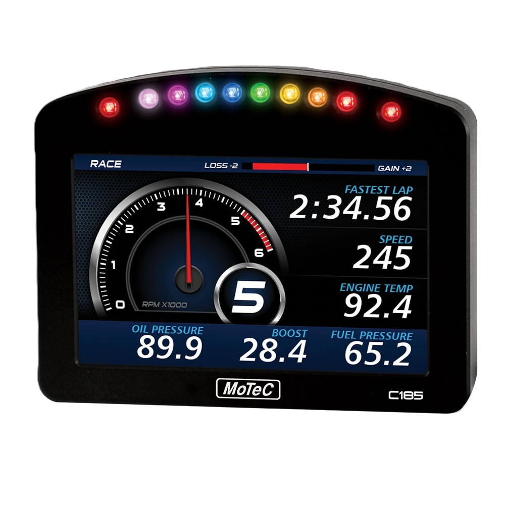
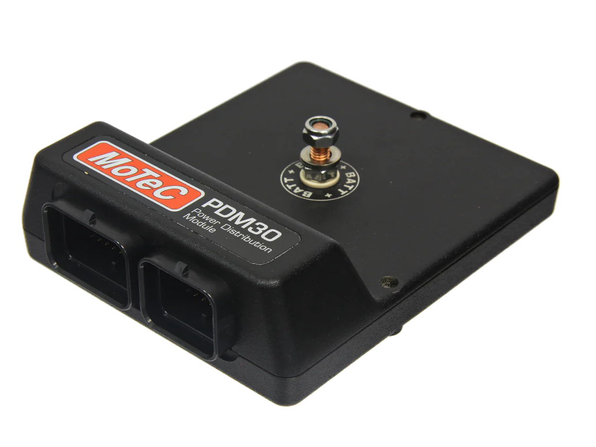

# Speedi-Tunes

Repository for tracking and managing key electronic configurations for the Duke Motorsports FSAE car. Begins with swimsuit model (2024-2025).
🔗 [GitHub Repo](https://github.com/DukeMotorsports/Speedi-Tunes)

---

## 1. ECU Tunes

We track ECU tunes at milestone points throughout development. We use the **MoTeC M150** ECU. 
**Software Version**: 1.4.0.302
(Compatible with Ver. 1.5)

  

---

## 2. Dash Configs

We currently run the **MoTeC C185** dash logger.
This configuration matches the latest firmware as of **July 27, 2025**.
We use the standard configuration and **do not** use Display Creator scripting.
**Software Version**: 6.50.0.G3
(Compatible with Ver. 1.5)

  

---

## 3. PDM Config

The Power Distribution Module in use is the **MoTeC PDM30**.
Current configuration matches our latest validated setup.

  

